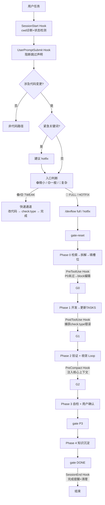
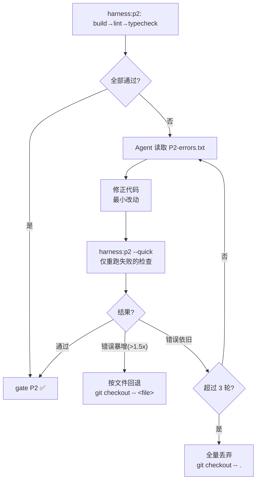

# DevFlow 工作流体系 v3.0

> 适用对象：团队内流程/效率/质量分享
> 目标：在不牺牲代码质量的前提下，显著降低 AI 使用过程中的 token 消耗与沟通摩擦
> 基线原则：**以 DevFlow 为唯一流程真相**；DevFlow 推进流程，Agent 执行 Phase 内工作并输出证据
> 强化手段：**Reasonix Hooks 运行时拦截**——将 AGENTS.md 的软约束升级为硬阻断
> 参考：[AGENTS.md](./AGENTS.md) · [REASONIX.md](./REASONIX.md)

---

## 0. 一页总结

### 0.1 四层防御体系

```
┌─────────────────────────────────────────────┐
│  Layer 1: AGENTS.md                         │
│  行为契约 — 入口判断 / Phase协议 / 跳过协议    │
├─────────────────────────────────────────────┤
│  Layer 2: 6 个 Reasonix Hooks                │
│  运行时拦截 — 注入 / 阻断 / 采集 / 保护 / 提醒 │
├─────────────────────────────────────────────┤
│  Layer 3: harness.mjs + WF-*.toml            │
│  执行引擎 — Gate 状态机 / 证据生成 / 收敛循环  │
├─────────────────────────────────────────────┤
│  Layer 4: pnpm check:type / build / lint     │
│  真实验证 — 类型检查 / 构建 / 代码规范         │
└─────────────────────────────────────────────┘
```

### 0.2 你最终得到什么

- 三条工作流路径：**FULL**（功能/重构）、**HOTFIX**（紧急修复）、**TWEAK**（微小改动）
- 5 个 Phase + 5 个 Gate + 收敛 Loop（最多 3 轮自动修正）
- **硬阻断门禁**：P0 未通过时 PreToolUse hook 拦截所有编辑操作
- 6 个生命周期 hook：注入状态、捕获错误、保护上下文、提醒完成
- 任务拆解体系：checkbox 格式 + `mapsTo` 追溯链 + 内容校验
- 证据规范：聊天 ≤6 行摘要，长日志/长 diff 写本地文件
- 知识沉淀：确认已解决后写入全局经验库，5 维去重
- 跨会话恢复：SessionStart hook 自动注入 DevFlow 状态

### 0.3 核心技术栈

| 组件 | 作用 |
|---|---|
| DevFlow CLI | 流程管理与步骤推进（唯一真相） |
| Reasonix Hooks（6个） | 运行时门禁：PreToolUse 阻断编辑、SessionStart 注入状态、PreCompact 保护上下文 |
| Harness（`harness.mjs`） | Gate 状态机 + 证据生成 + 验证 + 收敛循环（零外部依赖） |
| pnpm + TurboRepo | `check:type/build/lint` 真实执行 |
| compound-engineering | 改前检索 + 改后沉淀（复利工程） |
| codegraph（MCP） | 代码关系检索（符号、调用链、影响分析） |

---

## 1. 背景与痛点

- 过程不可审计：只看到最终结果，缺少可复现证据
- 质量不稳定：AI 顺手优化、猜 API、改出隐性回归
- 软约束不可靠：AGENTS.md 写"禁止跳过入口判断"，但 Agent 仍然可能跳
- token 消耗失控：长日志堆叠，反复确认
- 缺少复利：踩坑经验散落聊天，无法复用
- **跨会话丢失**：Session 关闭后 Agent 忘记上次走到哪个 Phase

---

## 2. 核心设计

### 2.1 四层架构

```
用户层：  /devflow full feat-xxx         ← 斜杠命令，一键启动
            │
DevFlow：  devflow:start / done          ← 步骤推进（WF-*.toml 驱动）
            │
┌───────────┴───────────────────────────────────┐
│  Reasonix Hooks（运行时拦截，6个生命周期事件）    │
│  SessionStart · UserPromptSubmit · PreToolUse      │
│  PostToolUse · PreCompact · SessionEnd         │
│  → 注入上下文 / 阻断违规 / 自动采集 / 保护状态    │
└──────────────┬────────────────────────────────┘
            │
Harness：  harness:p0~p4 / gate / ...    ← 证据 + 验证 + 门禁（JS 执行）
            │
底层：     pnpm check:type / build       ← 实际验证命令
```

### 2.2 角色与职责

| 角色 | 职责 | 不管什么 |
|---|---|---|
| **AGENTS.md** | 定义行为规则、Phase 协议、入口判断标准 | 不执行任何命令 |
| **Hooks** | 运行时拦截：PreToolUse 阻断编辑、SessionStart 注入状态、PreCompact 保护上下文 | 不做语义判断（纯 JS） |
| **DevFlow** | 步骤推进、Gate 序列 | 不执行具体验证 |
| **Harness** | Gate 状态机、证据生成、验证运行、收敛循环 | 不决策流程走向 |
| **Agent** | Phase 内工作（检索/实现/自检/沉淀），输出证据 | 不推进 Gate |

### 2.3 零外部依赖

唯一外部依赖：`pip install devflow`（Python CLI）。

Gate 序列校验、状态记录全内联到 `harness.mjs`（约 100 行），状态存储于 `.devflow/harness/state.json`。Hooks 脚本为纯 Node.js（`require('fs')` + `require('path')`），零 npm 依赖。

### 2.4 三条工作流路径 + 两级判定

**入口判定：紧急关键词扫描 → 先质后量分级**

| 路径 | 入口 | 适用场景 | 确认点 |
|---|---|---|---|
| **TWEAK** | 自动（🟢🟡）或 `/devflow tweak` | 🟢 纯样式/文案/调参 ≤3行 ≤2文件；🟡 4~20行 单组件内 | 0 次 |
| **FULL** | `/devflow full` | 🔴 新增路由/store/API/功能模块/跨模块/改契约 | P0 P1 P3 |
| **HOTFIX** | `/devflow hotfix` | 紧急修复，强制 blast-radius + 回滚预案 | P0 P1 P3 |

**分级速查表**（由 SessionStart hook 自动注入 Agent context）：

```
🟢 微小: ≤3行, ≤2文件, 纯样式/文案/调参 → TWEAK
🟡 一般: 4-20行, 3-5文件, 单组件内修改 → TWEAK (默认), 用户说"走流程"则转FULL
🔴 复杂: >20行 或 >5文件 或 新增路由/store/API/权限 → 强制FULL
```

**紧急关键词：** 用户消息含"紧急/线上/挂了/崩溃/hotfix/回滚"时，分级前先问"是否走 hotfix？"

**TWEAK vs FULL 差异：** TWEAK 不加载 project-constraints、不加载领域 skill、不做任务拆解、不填 P0 证据、所有 hook 直接放行（taskType: auto-skip）。

### 2.5 为什么需要 Hooks

- **AGENTS.md = 交通法规** — 定义规则，但无法阻止违规
- **Hooks = 红绿灯 + 摄像头** — PreToolUse 在 Agent 试图编辑文件前检查 `state.json`，P0 未通过时直接 block
- **Harness = 检测站** — 执行验证，产出可复现证据

三个系统互相配合：AGENTS.md 告诉 Agent 该做什么，Hooks 确保 Agent 不跳过关键步骤，Harness 验证做完的事是否合格。

---

## 3. Hooks 系统

### 3.0 Reasonix Hooks 基础

Reasonix 桌面端在 Settings → Hooks 中提供 hook 管理，配置文件为：

| 范围 | 文件 | 是否需要信任 |
|---|---|---|
| 全局 | `~/.reasonix/settings.json` | 不需要 |
| 项目 | `<workspace>/.reasonix/settings.json` | 需要（`/hooks trust`） |

**Reasonix 支持的 10 个生命周期事件：**

| 事件 key | 触发时机 | 可阻塞？ | stdout 特殊作用 |
|---|---|---|---|
| `SessionStart` | 会话首次活跃、`/new` 或清空后 | 否 | 无 |
| `SessionEnd` | 会话关闭、切换、`/new` 或清空 | 否 | 无 |
| `UserPromptSubmit` | 用户提交输入后、模型调用前 | **是** | 无 |
| `PreToolUse` | 工具权限通过后、执行前 | **是** | 无 |
| `PostToolUse` | 工具执行后（不管成功或失败） | 否 | 无 |
| `PostLLMCall` | 模型流式返回完成后 | 否 | exit 0 + stdout 非空时**替换**展示的 reasoning |
| `PreCompact` | 上下文压缩前 | 否 | stdout 追加为压缩摘要的额外指导 |
| `Stop` | 一轮对话结束后 | 否 | 无 |
| `SubagentStop` | 前台 `task` 子代理完成后 | 否 | 无 |
| `Notification` | 需要用户注意时（如等待审批） | 否 | 无 |

**Hook 配置对象字段：**

| 字段 | 类型 | 说明 |
|---|---|---|
| `command` | string | 必填。通过 `sh -c` 执行的 shell 命令。stdin 是 Reasonix 写入的一行 JSON。 |
| `match` | string | 仅 `PreToolUse`、`PostToolUse` 有效。正则，空或 `*` 匹配所有工具。**是锚定正则**（`"file"` 不会匹配 `read_file`）。 |
| `timeout` | number | 可选毫秒。阻塞型默认 5000ms，非阻塞型默认 30000ms。 |
| `cwd` | string | 可选。默认使用当前会话的 `cwd`。 |
| `description` | string | 可选。hooks 列表展示用。 |

**阻塞型事件（PreToolUse / UserPromptSubmit）退出码：**

| 退出码 | 含义 |
|---|---|
| `exit 0` | 通过，允许继续 |
| `exit 2` | 阻断，阻止工具/模型调用 |
| 其它非零 | 警告，不阻断 |
| 超时 | 阻断 |

**stdin Payload 格式（按事件区分）：**

| 事件 key | 额外 payload key | 示例 |
|---|---|---|
| `SessionStart` | 无 | `{"event":"SessionStart","cwd":"/repo"}` |
| `SessionEnd` | 无 | `{"event":"SessionEnd","cwd":"/repo"}` |
| `UserPromptSubmit` | `prompt`, `turn` | `{"event":"UserPromptSubmit","cwd":"/repo","prompt":"修复测试","turn":1}` |
| `PreToolUse` | `toolName`, `toolArgs` | `{"event":"PreToolUse","cwd":"/repo","toolName":"bash","toolArgs":{"command":"go test ./..."}}` |
| `PostToolUse` | `toolName`, `toolArgs`, `toolResult` | `{"event":"PostToolUse","cwd":"/repo","toolName":"bash","toolArgs":{"command":"..."},"toolResult":"ok"}` |
| `PreCompact` | `trigger` | `{"event":"PreCompact","cwd":"/repo","trigger":"manual"}` |
| `Stop` | `lastAssistantText`, `turn` | `{"event":"Stop","cwd":"/repo","lastAssistantText":"已修复","turn":1}` |

**加载时机：** 保存配置后**必须重启桌面端**才能生效。`/new` 只开启新对话，不会重新读取 hooks 配置。

**执行顺序：** 同一事件下项目 hooks 先运行，全局 hooks 后运行。阻塞型事件遇到第一个 `exit 2` 后停止执行后续 hook。

---

### 3.1 DevFlow 6 个 Hook 职责

| Hook | 事件 | 阻断？ | 功能 |
|---|---|---|---|
| `session-init.cjs` | SessionStart | ❌ | cwd 诊断 + state.json 损坏检测（输出 stderr） |
| `prompt-check.cjs` | UserPromptSubmit | ✅ | 匹配跳过流程关键词 → `exit 2` + stderr 阻断提交 |
| `gate-guard.cjs` ⭐ | PreToolUse (match: `.*`) | ✅ | 编辑工具：P0 未过 → `exit 2` + stderr；危险 bash（7 种）→ `exit 2` |
| `evidence-collector.cjs` | PostToolUse (match: `bash`) | ❌ | bash 含 check:type/lint 时从 `toolResult` 判断错误 → `last-check-errors.txt` |
| `compact-guard.cjs` | PreCompact | ❌ | 输出 DevFlow 核心上下文到 stdout → Reasonix 作为压缩指导 |
| `session-end.cjs` | SessionEnd | ❌ | DONE 时确认/未完成时提醒；仅 DONE 时清理临时文件 |

### 3.2 核心共享库：lib.cjs

所有 hook 脚本通过 `require('./lib.cjs')` 共享：

| 导出 | 用途 |
|---|---|
| `ACTIVE_TYPES` / `SKIP_TYPES` | taskType 常量 |
| `CORE_CONSTRAINTS` | 统一约束文本 |
| `resolveState()` | 读取 state.json，推断 Phase、收集风险标记 |
| `gateIcon(g)` | 统一 Gate 状态图标（正确处理裸字符串 timestamp） |
| `diagnoseCwd()` | 验证 Reasonix cwd 指向项目根 |
| `findDangerousCommand()` | 危险命令检测（7 种） |

### 3.3 state.json — 唯一状态中枢

```json
{
  "taskType": "full",
  "gates": { "P0": "2026-06-23T05:52:39.960Z", "P1": null, "P2": null, "P3": null, "DONE": null },
  "change": "hooks-integration"
}
```

- `taskType` 决定 hook 门禁是否生效（auto-skip/user-skip 全放行，full/mandatory/hotfix 需完整门禁）
- `gates` 存储 ISO 时间戳（裸字符串），序列校验 P[N] 需 P[N-1] 已声明
- `gateReset` 重置时彻底清空残留字段（lastRunId/p2FailedKeys/p2ConvergenceRound）
- 收敛时附加 `p2FailedKeys` + `p2ConvergenceRound`

**损坏保护：** state.json 存在但 JSON 解析失败 → gate-guard block 编辑 + session-init 注入 `⚠️ state.json 损坏` 警告。

---

## 4. 流程设计图

### 4.1 总览



### 4.2 收敛 Loop



### 4.3 Phase vs Gate

- **Phase = 把事情做完（Agent）** — 产出证据文件
- **Gate = 把完成变成硬事实（Harness）** — 记录时间戳 + 校验顺序 + **校验内容不为空壳**
- **Hook = 把软约束变成硬阻断（PreToolUse）** — P0 未通过时根本无法编辑文件

---

## 5. 阶段定义

### 5.0 成本收益

| 选择 | 代价 |
|---|---|
| 不做 Phase | 质量不稳定、不可复盘 |
| 做 Phase 不做 gate | 退化为口头约定 |
| 做 gate 不校验内容 | gate 变成形式主义（空壳 P0 也能过） |
| 做 gate 不加 hooks | 依赖 Agent 自觉，可能跳过入口判断 |
| **Phase + Hack + Gate + 内容校验（本方案）** | 成本略增，换来稳定的质量底线和硬执法 |

### 5.1 Phase 0 — 改前准备

1. 加载 `project-constraints`（同 session 已加载跳过）
2. `compound-engineering` 必须检索（每次不同）
3. 按需加载领域 skill（仅需求中用到的）
4. **任务拆解** → 写入 `.devflow/evidence/<change>/TASKS.md`：
  - `- [ ] N.M` checkbox 格式，`## N.` 分组，按依赖排列
  - 每项含 `files`、`verify`（可验证完成标准）、`mapsTo`（追溯 P0 条目）
5. 填 P0 槽位：**Scope**（文件/目录 + 非目标）、**Risks**（≥1 条）
6. 槽位填不出 MUST ask 用户，不得留占位符
7. 展示证据 → 用户确认

**Gate 校验：** P0.md 存在 + TASKS.md 存在 + Scope/Risks 无占位符（`harness:p0 --check`）+ TASKS 至少一条 checkbox 且无 `<任务描述>` 占位符（`harness:tasks --check`）

**Hooks 配合：** PreToolUse 在 P0 Gate 通过前 block 所有编辑 → 强制先完成改前准备。

### 5.2 Phase 1 — 开发

1. **读取 `TASKS.md`** 逐项执行，`- [ ]` → `- [x]`，输出 `📋 TASKS: 2/4 done`
2. ≤3 文件直接开发，否则委派 `devflow-worker`
3. 最小改动、不猜 API、确认无同类封装
4. 填 P1 槽位：**Changed files**（使用 `git diff --name-only` 获取）、**Non-goals respected**

**Gate 校验：** P1.md 存在 + `gateReady: YES`（`harness:p1 --check`）+ TASKS 至少一条 `- [x]`

### 5.3 Phase 2 — 验证 + 收敛 Loop

1. `harness:p2` **分层执行**：build → lint → typecheck，首失败即停
2. 全过 → 收敛
3. 失败 → 读 `P2-errors.txt`（仅错误行，非完整日志）→ 修正 → `harness:p2 --quick`（仅重跑失败项）
4. 最多 3 轮，错误暴增（>1.5x）按文件回退，3 轮不通全量丢弃
5. 收敛轮次持久化到 `state.json` → 会话中断后恢复时 Agent 知道当前是第几轮

**自动修正范围：** 缺失 import、类型标注不匹配、空值访问、未使用变量。禁止改业务逻辑、替换 API、重构结构。不确定（错误看不懂/需改 ≥2 函数签名/影响其他模块/运行时行为）→ 直接停下。

**Hooks 配合：** PostToolUse 自动捕获每次 check:type 的 exitCode → last-check-errors.txt；PreCompact 在压缩时保护收敛上下文不丢失。

### 5.4 Phase 3 — 收尾自检

1. `pipeline-guard` 自检（`.agents/skills/pipeline-guard/`）
2. `harness:gate-verify` 校验 P0/P1/P2 完整性
3. 用户确认（已解决/未解决）

### 5.5 Phase 4 — 知识沉淀

1. P3 已确认 → 跳过二次提问
2. 去重检查（5 维：现象/tech/领域/根因/解法）→ 4-5维更新、2-3维补充、0-1维新增
3. 写入 `.agents/skills/compound-engineering/references/` + 更新 INDEX.md
4. HOTFIX：优先 fix type，severity=high

---

## 6. 完整走查示例（🔴 FULL）

> 以"新增用户列表页，支持搜索和分页"为例。

### 入口

```
SessionStart Hook → cwd 诊断（stderr 无输出 = cwd 正确）

UserPromptSubmit Hook → 扫描"新增用户列表页" → 无跳过关键词 → exit 0 放行

Agent 入口判断（先质后量）:
  先看质: 新增路由 ✅ / 新增 API ✅ / 新增功能模块 ✅ → 🔴

⚠️ [MANDATORY] 新增路由+API+功能模块 → 强制 FULL
/devflow full feat-user-list
  → gate-reset --type full → select WF-FULL → set change → done×2 → phase0
```

### Phase 0 — 改前准备

```
[PHASE:0] 开始改前准备
📊 进度: 🔵 P0 → ⏳ P1 → ⏳ P2 → ⏳ P3 → ⏳ P4

① project-constraints → 同 session → 跳过
② compound-engineering → 检索命中的 Table 分页/搜索防抖经验
③ 加载 skill: 涉及 Table+Router → antdv-next ✅ vue-router ✅
   未涉及 Modal/Form/Pinia → 不加载

④ 任务拆解 → TASKS-feat-user-list.md:
   ## 1. Setup
   - [ ] 1.1 新增路由 /user/list | files: router/ | verify: 路由可访问 | mapsTo: P0 Scope
   - [ ] 1.2 新增搜索 API | files: api/user.ts | verify: check:type | mapsTo: P0 Scope
   ## 2. Core
   - [ ] 2.1 Table+搜索+分页 | files: views/user-list/ | verify: 搜索刷新/翻页/空态

⑤ P0 槽位: Scope(views/ router/ api/ / nonGoals: 不涉及权限编辑) Risks(空态兜底)
⑥ 槽位检查 → 无占位符 ✅
⑦ 展示 P0 + TASKS → 用户确认 ✅
⑧ Gate 校验: P0.md+TASKS.md 文件存在+内容不为空壳 ✅
   [GATE:P0] ✅ → PreToolUse Hook 放行编辑 → devflow:done → phase1
```

### Phase 1 — 开发

```
[PHASE:1] 开始开发
📊 进度: ✅ P0 → 🔵 P1 → ⏳ P2 → ⏳ P3 → ⏳ P4

① 读 TASKS 逐项: 路由✅ 1/3 → API✅ 2/3 → 列表页✅ 3/3
   每项 - [ ] → - [x]
② >3 文件 → 委派 devflow-worker
③ Worker: 写代码 → check:type 通过
④ P1 槽位: Changed files(router+api+view) Non-goals(未动权限)
   使用 git diff --name-only 获取
⑤ 展示 P1 → 用户确认 ✅
⑥ Gate 校验: P1.md+内容不空壳+TASKS 至少一条 - [x] ✅
   [GATE:P1] ✅ → devflow:done → phase2
```

### Phase 2 — 验证 + 收敛 Loop

```
[PHASE:2] 开始验证 (build → lint → typecheck)
📊 进度: ✅ P0 → ✅ P1 → 🔵 P2 → ⏳ P3 → ⏳ P4

① harness:p2 --build full --lint
   build ✅ lint ✅ typecheck ❌ (3 errors: TS2345/TS2304/TS6133)
   PostToolUse Hook 自动捕获 → last-check-errors.txt

② Agent 读 P2-errors.txt (仅 3 行错误):
   全部可修(类型标注/缺失定义/未使用变量)
   不涉及业务逻辑/函数签名/其他模块

③ [LOOP:2/1] 修正 → harness:p2 --quick(re-run typecheck only) → exit 0 ✅
   收敛轮次写入 state.json: p2ConvergenceRound = 1

④ [GATE:P2] ✅ ⚡auto-fixed (1 round)
   devflow:done → phase3
```

### Phase 3 — 收尾自检

```
[PHASE:3] 开始收尾自检
📊 进度: ✅ P0 → ✅ P1 → ✅ P2 → 🔵 P3 → ⏳ P4

① pipeline-guard → PASS
② gate-verify → P0/P1/P2 全部有 Gate 时间戳 → PASS
③ 用户确认: "3/3 任务完成，改动符合预期。已解决？" → 已解决 ✅
④ [GATE:P3] ✅ → devflow:done → phase4
```

### Phase 4 — 知识沉淀

```
[PHASE:4] 开始知识沉淀
📊 进度: ✅ P0 → ✅ P1 → ✅ P2 → ✅ P3 → 🔵 P4

① P3 已确认 → 跳过二次提问
② 去重(5维): "Table+搜索+分页" → 2维匹配 → 补充小节
   "TS2345 泛型推断" → 0维匹配 → 新增
③ 写入 experiences/ + INDEX.md
④ [GATE:DONE] ✅ → SessionEnd Hook → "✅ DevFlow feat-user-list 流程完成" + 清理临时文件
```

### TWEAK 对比

```
"把按钮颜色改成蓝色"
→ 扫紧急词 → 无
→ 🟢 纯样式 ≤3行 ≤2文件 → ⚠️ [AUTO-SKIP]
→ 所有 Hook 直接放行（taskType: auto-skip）
→ 轻量检索 → 改代码 → harness:tweak → check:type → [TWEAK:DONE]
```

### 用户做了什么

```
Phase 0:   看 P0 + TASKS → 点确认    ← 第 1 次
Phase 1:   看 P1 → 点确认            ← 第 2 次
Phase 2:   Agent 全自动(含 1 轮自动修正)
Phase 3:   看最终结果 → 点确认        ← 第 3 次
Phase 4:   Agent 全自动
```

**全程 3 次确认，0 次手动推进，1 次自动修正，每步有标记、有证据、有硬阻断、有状态持久化。**

---

## 7. 证据设计

### 7.1 为什么

- 防止"看起来对"的口头结论
- 让流程推进变成机器可判定（exit code、文件存在、Gate 通过、内容不为空壳）
- token 降本：长内容落地到文件

### 7.2 证据分层

| 层 | 内容 | 位置 |
|---|---|---|
| 聊天（≤6 行） | 结论 + 路径 + 进度 | 对话中 |
| 本地证据文件 | 全量日志、diff、验证输出 | `.devflow/evidence/<change>/` |
| 全局经验库 | 结构化可复用知识 | `.agents/skills/compound-engineering/` |

### 7.3 聊天摘要模板

```text
[PHASE:2] 开始验证 (build → lint → typecheck)
📊 进度: ✅ P0 → ✅ P1 → 🔵 P2 → ⏳ P3 → ⏳ P4
📁 证据: P0=evidence/<change>/P0.md  P1=evidence/<change>/P1.md  TASKS=evidence/<change>/TASKS.md
📋 任务: 4/4 done

check:type: PASS | build: PASS | lint: PASS
[GATE:P2] ✅
```

---

## 8. 文件结构

```
.devflow/
├── evidence/
│   └── <change>/               ← 按变更名称分组
│       ├── P0.md               ← 改前：Scope、Risks
│       ├── TASKS.md             ← 任务清单（checkbox 格式，含 mapsTo 追溯）
│       ├── P1.md               ← 改后：文件列表、non-goals
│       ├── P2.md               ← 验证：分层执行结果 + 收敛日志
│       ├── P2-errors.txt        ← 收敛 Loop 用：仅错误行（瘦身版）
│       ├── P3.md               ← 验收：自检 + 用户确认
│       ├── P4.md               ← 沉淀：经验路径
│       ├── TWEAK.md            ← 微调：改动 + check:type
│       └── SKIP.md             ← 跳过：标记 + 原因
├── harness/
│   └── state.json              ← Gate 状态中枢（taskType + gates + change + p2FailedKeys + p2ConvergenceRound）
├── hooks/
│   ├── lib.cjs                 ← 共享工具库（状态解析、Gate图标、危险命令、约束文本）
│   ├── gate-guard.cjs          ← PreToolUse 门禁阻断
│   ├── session-init.cjs        ← SessionStart cwd 诊断
│   ├── prompt-check.cjs        ← UserPromptSubmit 跳过声明阻断
│   ├── evidence-collector.cjs  ← PostToolUse 错误捕获
│   ├── compact-guard.cjs       ← PreCompact 上下文保护
│   ├── session-end.cjs         ← SessionEnd 提醒+清理
│   ├── verify.cjs              ← 验证脚本（8项测试，双场景）
│   └── node-shim.sh            ← Node 启动器（解决 nvm 环境下 PATH 无 node 的问题）
├── workflows/
│   ├── WF-FULL.toml
│   ├── WF-HOTFIX.toml
│   └── WF-TWEAK.toml
└── state.toml                   ← DevFlow CLI 状态
.reasonix/
└── settings.json              ← Hook 配置（Reasonix 原生，6事件绑定）
scripts/
└── harness.mjs                  ← Gate 状态机 + 证据生成 + 验证（约 990 行）
```

---

## 9. Token 降本策略

- 命令输出、长堆栈、长 diff → 写入证据文件
- 对话只留摘要 + 路径（≤6 行）
- P2 失败时 Agent 读 `P2-errors.txt`（仅错误行），不读完整证据
- 收敛 Loop 重试用 `--quick`，仅重跑失败的检查
- WF prompt 精简到仅 Gate 命令 + AGENTS.md 引用
- Phase 0 技能同 session 缓存
- PreCompact hook 保护压缩时核心规则不丢失

---

## 10. 代码质量

### 10.1 保证

- 类型正确：`check:type` 通过
- 构建正确：`build` 通过
- 可审计：阶段证据完整 + Gate 时间戳
- 流程防御：PreToolUse 硬阻断 + P0 证据占位符检测 + Gate 序列校验 + taskType 白名单

### 10.2 不自动保证

- 业务逻辑正确性 → 验收标准 + P3 用户确认
- UI/交互 → 最小 smoke checklist
- 端到端 → 未来可引入 e2e

---

## 11. 常见问题

### Q1：DevFlow、Harness、Hooks 是什么关系？

DevFlow 是方向盘（步骤推进），Harness 是发动机（执行验证 + 生成证据），Hooks 是刹车和仪表盘（阻断违规 + 诊断）。WF-*.toml 定义步骤和 Gate 序列，`.reasonix/settings.json` 绑定 6 个生命周期事件到外部脚本。

### Q2：PreToolUse 门禁会不会误伤？

不会。三种情况放行：① taskType 为 auto-skip/user-skip（TWEAK 路径）② state.json 不存在（非 DevFlow 会话）③ 写入 `.devflow/` 下的证据文件。

### Q3：token 为什么能明显下降？

长内容落地证据文件，对话只输出摘要。P2 失败时读 `P2-errors.txt`（仅错误行），收敛 Loop 重试用 `--quick`。

### Q4：收敛 Loop 会不会越修越坏？

不会。错误暴增（>1.5x）时按文件回退（`git checkout -- <file>`），3 轮不通全量丢弃（`git checkout -- .`）。收敛轮次持久化到 state.json，会话中断后恢复时 Agent 知道当前轮次。

### Q5：三种模式怎么选？

- 🟢🟡 自动 TWEAK（🟡 说"走流程"转 FULL）
- 🔴 `/devflow full`
- 紧急 → 关键词触发建议 → `/devflow hotfix`

### Q6：空壳证据能通过 Gate 吗？

不能。`harness:p0 --check` 校验 Scope/Risks 无占位符，`harness:tasks --check` 校验至少一条 `- [ ]` 或 `- [x]` 且无 `<任务描述>` 占位符。Phase 1 的 TASKS check 还要求至少一条 `- [x]`。**两处 TOML Phase 0 Gate 均已接入 `p0 --check`。**

### Q7：Session 关闭后怎么恢复？

Agent 在 SessionStart 时按 AGENTS.md「跨会话恢复」协议主动读取 `state.json`——看到 "📊 DevFlow: feat-xxx | full | Phase 2 | Gate: P0✅ P1✅ P2⬜" 就知道该从 Phase 2 继续。

### Q8：保存 hooks 配置后为什么不生效？

Reasonix 在会话构建时加载 hooks 配置。保存 `.reasonix/settings.json` 后**必须重启桌面端**（`/new` 只开启新对话，不重新加载 hooks）。项目 hooks 还需要执行 `/hooks trust` 信任工作区。

### Q9：怎么确认 hooks 是否正常工作？

运行 `node .devflow/hooks/verify.cjs`（模拟所有 hook 的 stdin payload，检查退出码和输出）。也可以打开 Reasonix Settings → Hooks 面板查看 hook 执行日志。

### Q8：state.json 损坏了怎么办？

gate-guard 在 JSON 解析失败时 exit 2 阻断所有编辑 → Agent 被引导运行 `harness:gate-reset`。SessionStart hook 检测到损坏时输出 stderr 警告。gateReset 始终写入干净的有效 JSON。

---

## 12. 常用命令

| 场景 | 命令 |
|---|---|
| 启动工作流 | `/devflow full\|hotfix\|tweak <name>` |
| 查看当前步骤 | `pnpm -s run devflow:current` |
| 推进/回退 | `pnpm -s run devflow:done` / `devflow:back` |
| 重置 Gate | `pnpm -s run harness:gate-reset -- --type full` |
| 信任项目 hooks | `/hooks trust` |
| 验证 hooks 是否正常 | `node .devflow/hooks/verify.cjs` |
| 单独运行 Phase 2 验证 | `pnpm -s run harness:p2 -- --id <change> --build full --lint` |
| 按文件回退 | `git checkout -- <file>` |

### 质量门禁

- Typecheck：`pnpm -s run check:type`
- Build：`pnpm -s run build`
- Lint：`pnpm -s run lint`
